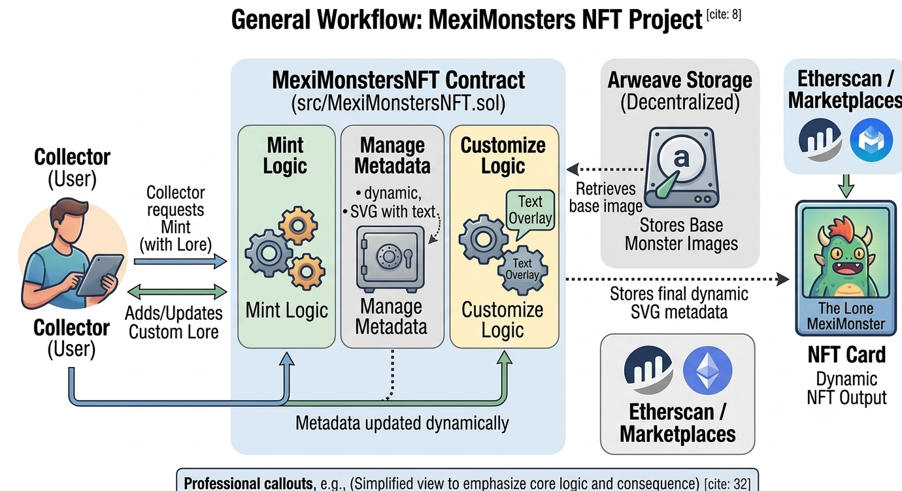

<div align="center">
  <h1>🔄 MexiMonsters NFTs</h1>
</div>

## 📖 About the Project
**MexiMonsters NFT** is a highly optimized, production-ready Web3 Smart Contract project built with Solidity `0.8.30` and thoroughly tested using the Foundry framework. The project implements a unique interactive NFT experience where users don't just hold an asset, but actively shape its metadata.

At its core, MexiMonsters leverages the **gas-efficient ERC721A standard** for batch minting. It goes beyond static images by combining decentralized Arweave storage (for base artwork) with on-chain SVG compositing. This allows NFT owners to write custom "lore" (text) directly to the blockchain, which dynamically overlays onto the NFT's image. Furthermore, it supports **ERC-4906 standard** events to automatically trigger OpenSea metadata refreshes when an owner toggles their monster between "Day" and "Night" modes.

**Key Technical Highlights:**

* **Solidity 0.8.30**: Leveraging up-to-date compiler features and custom errors for maximum gas efficiency.

* **ERC721A Integration**: Optimized batch minting capabilities ensuring users pay minimal gas even when minting multiple tokens.

* **On-Chain SVG Compositing**: Dynamically generates base64 encoded SVGs by pulling Arweave image links and rendering user-submitted text directly within the smart contract layer.

* **ERC-4906 Metadata Updates**: Ensures major marketplaces (like OpenSea) immediately reflect user-driven changes (Lore updates or Day/Night toggles).

* **Foundry Framework**: Complete with high-speed testing, advanced prank/cheatcodes, and full state assertions.

---

## ⚙️ How It Works

Users interact with the MexiMonstersNFT contract to mint tokens by selecting a specific archetype (e.g., Godinez, Mirrey, Buchon) and gender. Once minted, the contract stores a struct (MonsterState) for each token ID.

Owners can call `updateMonsterLore()` to inject a custom string (up to 32 characters) into their token's state, or call `toggleDayNight()` to flip a boolean. When the `tokenURI()` is queried, the contract dynamically builds an SVG image. It uses the token's state to determine the correct Arweave base image link, sets the text/banner color (e.g., bloody red for night, black for day), overlays the custom lore, and packages it into a standard JSON metadata format—all calculated 100% on-chain.

### Architecture Diagram

 

### Core Component File Paths
* [`MexiMonstersNFT.sol`](./src/MexiMonstersNFT.sol) - Main Application Logic - ERC721A NFT
* [`DeployNFT.s.sol`](./script/DeployNFT.s.sol) - Main Deployment Script
* [`MexiMonstersNFTScript.s.sol`](./script/MexiMonstersNFTScript.s.sol) - Test Deployment Script
* [`MexiMonstersNFTTest.t.sol`](./test/MexiMonstersNFTTest.t.sol) - Foundry Test Suite

---

## 💻 Technical Docs
The primary interaction points of the application handle minting, state toggling, and the complex tokenURI generation. The contract enforces strict ownership checks before allowing state modifications.

### mint
Allows users to mint NFTs by defining their preferred Archetype and Gender. Uses ERC721A `_safeMint` for batch gas savings and initializes the MonsterState.

```Solidity
    function mint(uint256 quantity, Archetype archetype, Gender gender) external payable {
        if (totalSupply() + quantity > getMaxSupply()) revert MexiMonstersNFT__ExceedsMaxSupply();
        if (msg.value < getMintPrice() * quantity) revert MexiMonstersNFT__InsufficientPayment();

        uint256 startTokenId = _nextTokenId();

        _safeMint(msg.sender, quantity);

        for (uint256 i = 0; i < quantity;) {
            s_tokenStates[startTokenId + i] = MonsterState({
                isNight: false, // Starts in Day mode by default
                archetype: archetype,
                gender: gender,
                customLore: ""
            });
            unchecked { i++; }
        }
    }
```

### toggleDayNight
Allows the NFT owner to manually toggle the environmental state of their NFT. Emits an ERC-4906 MetadataUpdate event to refresh marketplace caches automatically.

```Solidity
    function toggleDayNight(uint256 tokenId) external {
        if (!_exists(tokenId)) revert MexiMonstersNFT__TokenDoesNotExist();
        if (ownerOf(tokenId) != msg.sender) revert MexiMonstersNFT__NotTheOwner();

        // Flip the boolean (if true becomes false, if false becomes true).
        s_tokenStates[tokenId].isNight = !s_tokenStates[tokenId].isNight;

        // Tell OpenSea to refresh the metadata and image!
        emit MetadataUpdate(tokenId);
    }
```

### updateMonsterLore
Enables owners to add a custom message overlay to their NFT artwork, paying a small anti-spam fee if configured.

```Solidity
    function updateMonsterLore(uint256 tokenId, string calldata newLore) external payable {
        if (!_exists(tokenId)) revert MexiMonstersNFT__TokenDoesNotExist();
        if (ownerOf(tokenId) != msg.sender) revert MexiMonstersNFT__NotTheOwner();
        
        bytes memory loreBytes = bytes(newLore);
        require(loreBytes.length < 32, "Lore too long, 32 chars max.");

        if (msg.value < getUpdateLorePrice()) revert MexiMonstersNFT__InsufficientPayment();

        s_tokenStates[tokenId].customLore = newLore;

        emit MetadataUpdate(tokenId);
    }
```

### tokenURI (SVG & JSON Generation)
Snippet showing the dynamic SVG text overlay logic. Converts on-chain variables into visual SVG elements before Base64 encoding.

```Solidity
        // ... (inside tokenURI) ...
        bytes memory svgTextOverlay = "";
        if (bytes(state.customLore).length > 0) {
            
            // Dynamic styling based on Day/Night state
            string memory bannerColor = state.isNight ? "rgba(0,0,0,0.8)" : "rgba(255,255,255,0.85)";
            string memory textColor = state.isNight ? "#8A0303" : "#000000"; // Bloody Red for Night, Black for Day
            
            // Constructs the banner and text with the dynamic colors
            svgTextOverlay = abi.encodePacked(
                '<rect x="150" y="860" width="700" height="80" fill="', bannerColor, '" rx="20"/>', 
                '<text x="500" y="910" font-family="Verdana, sans-serif" font-size="32" font-weight="bold" fill="', textColor, '" text-anchor="middle">', 
                state.customLore, 
                '</text>'
            );
        }
        
        bytes memory finalSVG = abi.encodePacked(svgStart, svgTextOverlay, '</svg>');
        // ... (Continues to Base64 encode and package JSON)
```

## 🚀 Execution Example
Here is a step-by-step example of how a user interacts with the MexiMonsters ecosystem.

- Step 1: Setup & Deploy
The contract is deployed by the Owner using the DeployNFT.s.sol script. During deployment, the maximum supply (2000), base mint price, and lore update price are configured.

- Step 2: Minting
A User wants to mint 1 Godinez Male character. They call mint(1, Archetype.Godinez, Gender.Male) and pay the required Ether. They receive Token ID #1.

- Step 3: Initial State
If the user views their NFT on OpenSea, it displays a standard Godinez Male image hosted on Arweave, with no text on the bottom, in "Day" mode.

- Step 4: Updating the Lore
The user decides they want their monster to say "El Jefe". They call updateMonsterLore(1, "El Jefe"). The contract validates the character limit (<32) and updates the on-chain struct. The contract emits a MetadataUpdate event. OpenSea refreshes the image, which now features a stylized banner at the bottom containing the text "El Jefe".

- Step 5: Toggling Day/Night
The user calls toggleDayNight(1). The contract flips isNight to true. The tokenURI instantly adapts: the underlying Arweave base image switches to the night variant, the SVG text banner turns dark, and the "El Jefe" text turns bloody red. Another MetadataUpdate ensures marketplaces update instantly.

## ⬆️ Installation
Ensure you have Foundry installed on your machine. Install the required project dependencies:
```Bash
forge install chiru-labs/ERC721A OpenZeppelin/openzeppelin-contracts foundry-rs/forge-std
```

## 🧪 Testing
```Bash
forge test -vvvv
```

## 📊 Coverage
```Bash
forge coverage
```

## 📜 Contract Address - Deployed in testnet Curstis of Apechain
- 0xC8fEF1D263b2c8f37B9856FE65AC350a931252c9